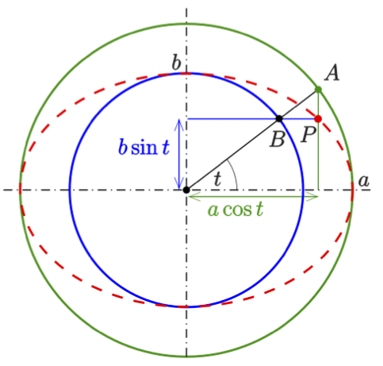
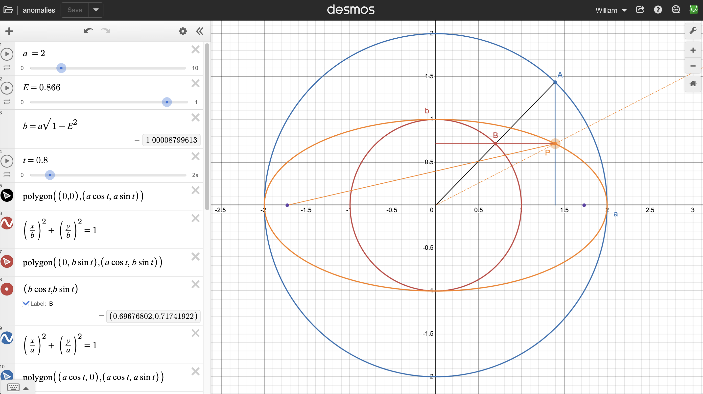
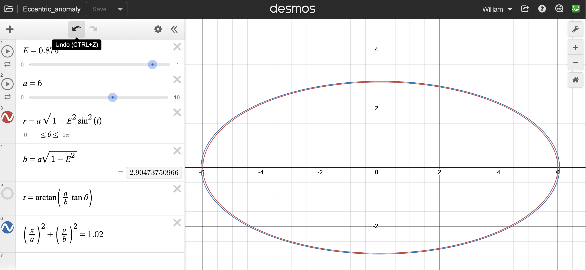

::: {.content-visible when-format="html"}
<nav class="packet-nav" aria-label="Packet navigation">
<a href="/aa/ss/2026-2027/">AA:SS class page</a>
<a href="/aa/assignments/ss_kepler1.zip">Download assignment (.zip)</a>
<a href="/aa/ss/kepler1/ss_kepler1.pdf">Student PDF</a>
<a href="/">Home</a>
</nav>
:::

- Kepler's Laws in brief

- Constructions and representations of ellipses

  - Geometric method

    - (semi-)major/minor axes, foci, and eccentricity

    - apsides

  - Algebraic method

    - Cartesian

    - Polar

  - Conic sections

[Tycho Brahe](https://en.wikipedia.org/wiki/Tycho_Brahe)
hired [Johannes Kepler](https://en.wikipedia.org/wiki/Johannes_Kepler) to
study his data on the motion of celestial objects and figure out what
they meant. It took Kepler 20 years, but he eventually managed to come
up with the following organization:

1.  A planet's orbit around the Sun is an **ellipse** with the Sun at
    one **focus** (and nothing at the other).

2.  The (imaginary) line connecting the planet to the Sun sweeps out
    equal areas in equal times.

3.  The square of the period $P$ of a planet's orbit is proportional to
    the cube of the length of its **semi-major axis** $a$.

In this packet, we will explore the meaning of these statements and
investigate their validity. As usual, terms in bold are concepts you
will need to know for summative evaluations.

# Ellipses

In order to understand Kepler's Laws, we will need to understand
ellipses. There are a few formulations of ellipses:

- as stretched out circles

- as a locus of points with fixed distance from certain points

- as solutions to algebraic equations

- as conic sections

Proving that they are all equivalent is a difficult task that we will
not attempt to undertake in detail, but knowing that they are all equivalent will
help us to gain a deeper understanding of them, and we will do some
exercises and see some demonstrations of the relations between them.

## Geometric Method

In class, we discussed the geometric construction of ellipses as a locus
of points a certain distance from two **foci**: Take two distinct points
$F_{1}$ and $F_{2}$ and take a third distinct point $P$. Let $\ell_{1}$
denote the length of the line $F_{1}P$ and let $\ell_{2}$ denote the
length of the line $F_{2}P$. The sum $\ell_{1} + \ell_{2}$ is the sum of
the distances between $P$ and the foci $F_{1}$ and $F_{2}$. Now consider
the collection of all points for which the analog of the quantity
$\ell_{1} + \ell_{2}$ gives the same value as it did for $P$. This
collection of points is an ellipse with $F_{1}$ as one focus and $F_{2}$
as the other.

> ### Problem 1.
>
> In this exercise, you will make 6 ellipses of various shapes and sizes using card stock (letter paper size), 2 push pins, and 2 loops of string. (Some organization is needed to get all 6 ellipses on the same sheet, so *read all instructions before you start*.)
>
> a) Using cardboard matting (provided in class), prick the push pins into your paper. These will be the foci $F_{1}$ and $F_{2}$. Make a short loop of string that fits around your pins. Then take a pencil and pull the loop so that it makes a triangle with vertices $F_{1}$, $F_{2}$, and your pencil tip (called it $P$). Keeping the string taut, trace out an ellipse with your pencil.
>
> b) Repeat this two more times with the same loop but with different distances between the foci.
>
> c) Make a new loop of a different size and repeat the steps above to make a total of 6 ellipses.
>
> d) For each ellipse, draw the line segment passing through the foci and ending on the ellipse. Find the **center** of that line and through that point, draw an orthogonal line segment ending on the ellipse. These are called the axes of the ellipse.

In this exercise, do not let your ellipses overlap! Make sure you leave enough room to fit all of them. If they do not fit, just get a new page and keep working.

One of the axes in part d of this problem is longer than the other. The
longer axis is the **major axis** of the ellipse and the shorter one is
the **minor axis**. These are the analogues of the diameter of a circle.
More convenient notions are the analogs of the radius: these half-axes
are called the **semi-major axis** and **semi-minor axis**. Note that if
the lengths of these axes are equal, then the ellipse becomes a circle
and the foci merge to become the center of the circle.

> ### Problem 2.
>
> For each ellipse you made in problem 1, measure and write down the
>
> a.  distance from the center of the ellipse to the foci
>
> b.  length of the semi-major axis
>
> c.  length of the semi-minor axis

## Algebraic Method

Geometric methods are good for constructing ellipses, but if we want to
plot and manipulate them, algebraic methods are more useful. As our
starting point, consider the set of solutions to the equation

$$
\left( \frac{x}{a} \right)^{2} + \left( \frac{y}{b} \right)^{2} = 1 \tag{1}
$$

which we recognize as a generalization (stretching) of a circle.

> ### Problem 3.
>
> Plot this on Desmos.[^1] Make sliders for $a$ and $b$. What happens when $a \rightarrow b$? What happens when $a \rightarrow \infty$? What's the difference between $a > b$ and $a < b$? To what do $a$ and $b$ correspond in your ellipse?

By convention, we will assume $b \leq a$. As before, we call the
semi-axis with length $a$ the **semi-major axis** and the semi-axis with
length $b$ the **semi-minor axis**. How much the circle is stretched
depends on how different $b$ is from $a$. In other words, it depends on
how much $\frac{b}{a}$ differs from $1$. A convenient combination used
to quantify the deviation from a circle is the **eccentricity**

$$
e =\sqrt{1-\left(\frac{b}{a}\right)^2} \quad \quad\textrm{(eccentricity)} \tag{2}
$$

> ### Problem 4.
>
> In your Desmos ellipse model, change the limits on your sliders so that $b \leq a$. Define a new parameter called $E$ that calculates the eccentricity of your ellipse. (Why can't you define it to be $e$? Hint: Type $e$ and see what it does.[^2]) Vary your $a$ and $b$ until you are convinced you understand what is happening with the eccentricity. The eccentricity is bounded in value between what and what?

> ### Problem 5.
>
> By squaring and rearranging the definition (2) of the eccentricity, write a new parameterization of an ellipse in terms of $a$ and $e$ and test it out on Desmos. This is the parameterization used in astronomy. What is happening to the ellipse as $e$ approaches $1$ from below? (Hint: You can successively put in $0.9$, $0.99$,$0.999$, *etc.* for the value by hand if the slider is too difficult to manipulate.)

The **foci** of the ellipse come together when $e \rightarrow 0$ and
migrate out to the points $(x,y) = ( \pm a,\ 0)$ when $e \rightarrow 1$.
This suggests that the foci might be at points on the $x$-axis a
distance $c = e\ a$.

> ### Problem 6.
>
> Plot the points $( \pm e\ a,\ 0)$ in addition to your ellipse and move the sliders around. Shift your ellipse so that the focus on the left becomes the origin for any value of $a$ and $e$. We will often assume the ellipse is arranged in this way.

With the left focus singled out for star placement, the point $(-(1-e)a,0)$
is the closest point on the ellipse to this focus. This position is
called **periapsis**. When there is actually a star at the focus, the
corresponding point on an orbit is called **periastron**. When that star
is our star, it is called **perihelion**. Similarly, the point on the
other side of the ellipse farthest from the left focus is called
**apoapsis**, **apastron**, or, **aphelion**. When we are referring to
either of these points, the appropriate terminology is
[**apsis**](https://en.wikipedia.org/wiki/Apsis) and the
plural is **apsides**.

> ### Problem 7.
>
> If the distance from the center to a focus is $ea$, what is the distance from the focus to periapsis? What is the distance from the focus to apoapsis? Draw a picture of a sufficiently-elliptical ellipse[^3] and label the distances $a$, $b$, $c = ea$, and $(1 - e)a$. Also draw the line connecting the point $(0,b)$ to either focus and show it has length $a$.

## Polar parameterization

If you have taken trigonometry, you will be familiar with the identity
$\sin^{2}(t) + \cos^{2}(t) = 1$.

> ### Problem 8.
>
> If you have taken trig, verify this identity geometrically from Pythagoras's Theorem. If you have not taken trig, do the following things on Desmos:
>
> a. Draw the graph for $\sin(x)$. Note that it is periodic. Draw the points $(2\pi\ m,0)$ with $m = 0, \pm 1, \pm 2$, and keep doing that until you have convinced yourself you know what is going on.
>
> b. Repeat this exercise for $\cos(x)$.
>
> c. Define the functions $f(x) = \sin^{2}(x)$ and $g(x) = \cos^{2}(x)$ and plot them. Note that they look similar and that they are bounded between 0 and 1.[^4]
>
> d. Graph the function $f + g$. What does it equal?

> ### Problem 9.
>
> Use this property of the sine and cosine to solve the equation for the ellipse in terms of $a$, $b$, $\sin t$, and $\cos t$. Define the radial coordinate $r =\sqrt{x^2 + y^2}$ and calculate it out, rewriting all terms with $b$ in it in terms of $a$ and $e$.

## Algebro-geometric synthesis

You have now found the ellipse in a parameterization resembling radial variables, but these are not the most convenient variables for a geometric description or the description of orbital motion. For starters, $r=0$ is at the center of the ellipse, whereas Kepler's first law places the primary body at one of the foci. Furthermore, and surprisingly (to me at least), $t$ is not the angle subtended by the semi-major axis and the line connecting the point on the ellipse with the center. Instead, it is a parameter, called the *eccentric anomaly* (usually labeled $E$ in astronomy), that has a less-than-obvious geometrical interpretation discovered by a seventeenth-century polymath named [Philippe de La Hire](https://en.wikipedia.org/wiki/Philippe_de_La_Hire).

{width=300px fig-alt="Eccentric and true anomaly diagram." fig-cap=""}

In the diagram above, $t$ denotes the [eccentric anomaly](https://en.wikipedia.org/wiki/Eccentric_anomaly). The ray from the origin does not intersect the point $P$ on the ellipse.

[Desmos](https://www.desmos.com/calculator/5qnnz0weqs)

A more useful parameterization has one focus as the origin with the angle $\theta$ being that between the ray through that focus to the point on the ellipse and the semi-major axis. This obvious/naïve angle is called the *true anomaly* (often labeled by $\nu$ or $f$). Henceforth, the radial distance (between the point on the ellipse and the focus) will be denoted by $r$ and $\theta$ will denote the true anomaly. In these variables, the equation for the ellipse is given by

$$
r = \frac{a(1 - e^{2})}{1 - e\cos\theta} \tag{3}
$$

> ### Problem 10.
>
> Go back to your ellipse from problem 6, and plot another in the form (3). Modify your formula so you get the same ellipse.

Note that in the two parameterizations of the ellipse, $r$ denotes the "obvious" thing. The two different anomalies are each "obvious" or "naïve" definitions in different mathematical contexts. In the algebraic context (the one we started with as a set of solutions to a quadratic equation in the plane), it was more natural to define the eccentric anomaly $t$ as the parameter along the solution set. In the geometric context (based on distances and angles), the true anomaly $\theta$ is the one that is apparent. A formula relating the eccentric anomaly to the true anomaly is

$$
\cos t= - \frac{e-\cos \theta}{1-e \cos \theta}
$$

If you are very interested, you can use it to derive the form (3) from your previous work, but you should remember to first shift the origin from the center to the focus. For more about these anomalies and how to translate between them, you could start [here](https://en.wikipedia.org/wiki/Eccentric_anomaly), but I warn you that it's a rabbit hole!

Warning: All my anomalies are off by $\pi$. For graphical reasons, I shifted the ellipses to the right so that most of it has positive values of $x$. However, astronomers naturally start the anomalies as periapsis not apoapsis, so my $\theta =0$ is would be $\theta=\pi$ in the astronomy literature. If your explorations lead you to strange signs, this is probably the reason.

### Anomaly matching

This is the "solution" to a question I did not ask you. I am writing it for those who really want to carry through the derivations and compare anomalies.

Firstly, my anomalies are off by a summand of $\pi$. Switching to astronomer conventions, define the eccentric anomally by $E=t+\pi$ and the true anomaly by $f=\theta +\pi$. Notice that the signs and cosines will have opposite signs in these variables. Next, let's start with the algebraic definitions, but shift the origin to the left focus (my convention, not astro convention). Then $x=a\left(e+\cos t\right)$ and $y=b\sin t= a\sqrt{1-e^2}\sin t$, so repeatedly using $\sin^2t+\cos^2t=1$,

$$
\begin{aligned}
r^2 &=a^2 \left[
    e^2 +2e\cos t +\cos^2 t + \left(1-e^2\right) \sin^2t
\right]\cr
   &=a^2 \left[ 1+ e^2 +2e\cos t -e^2\sin^2t
\right] \cr
   &=a^2 \left[ 1+ e^2 +2e\cos t -e^2\left(1-\cos^2t \right)
\right]\cr
   &=a^2 \left[ 1 +2e\cos t + e^2\cos^2t
\right]\cr
   &=a^2 \left[ 1 + e\cos t
\right]^2
\end{aligned}
$$

we find the satisfying result that

$$
\boxed{r=a\left( 1+e\cos t\right)}
$$

Now we must replace this with the true anomaly using the equation for $\cos t$ above. Then

$$
\begin{aligned}
r &= a\left( 1 - e \frac{e-\cos \theta}{1-e \cos \theta} \right)\cr
    &=a\frac{1-e \cos \theta - e^2 + e\cos \theta}{1-e \cos \theta}
\end{aligned}
$$

and we recover the polar form we plotted in problem 10.

{width=650px fig-alt="Eccentric and true anomaly diagram." fig-cap=""}

Eccentric and true anomaly ([desmos link](https://www.desmos.com/calculator/pf93gkir7b)): The ellipse with semi-major axis $a$ and semi-minor $b$ is in orange. The blue and red circles have radii $a$ and $b$, respectively. The eccentric anomaly is desribed by the $t$ parameter which is the angle between the back ray and the $+x$-direction. You can clearly see that it does not correspond to the dotted orange line through the point $P$ with coordinates $\pmatrix{x\\y}=\pmatrix{a\cos t\\ b\sin t}$ on the ellipse.  Instead, it goes through both $A$ with coordinates $a\pmatrix{\cos t\\ \sin t}$ and $B$ with coordinates $b\pmatrix{\cos t\\ \sin t}$.

Let's call the angle corresponding to the dotted line $\phi$. Then you can see from the diagram that $\tan \phi$ is smaller than $\tan t$ by a factor of $b/a$. Thus,

$$
\tan \phi = \frac {b}{a} \tan t
$$

If you solve it for $t$ and plug it into your parameterization, you will get the correct ellipse as I'm demonstrating here:

{width=500px fig-alt="Eccentric and true anomaly diagram." fig-cap=""}

Note, however, that this still not the true anomaly. To get that, what we really want is the angle $\theta$ of the orange line from the left focus makes with the $+x$-axis. (Yes, I am still using the wrong convention for the purposes of teaching. Sorry!) <!---Doing the trig for that gives

$$
\left( ea +a\cos t \right) \tan\theta
    = a\cos t \tan\phi
    = b \sin t
$$

or

$$
\tan \theta = \frac{b}{a}\frac{\sin t}{e +\cos t} = \sqrt{1-e^2}\frac{\sin t}{e +\cos t}
$$

--->

A final annoying thing is that neither of these are directly related to the physical time parameter of an object in orbit around the attracting focus. The parameter that is directly proportional to this time is called the *mean anomaly* $M$. It is related to the eccentric anomaly by the formula

$$
M = t+e\sin t
$$

This is called [Kepler's equation](https://en.wikipedia.org/wiki/Kepler's_equation).
The bummer about this is that it is a transcendental equation for eccentric anomaly $t$: That's bad news because the radius has a simple expression in terms of the eccentric anomaly, so it is impossible to get a formula in "closed form" for the motion in terms of the physical time!

As eccentric as the eccentric anomaly is, it is a more straightforward parameterization of the *shape* of the orbit than using the true anomaly and much simpler than using the mean anomaly (bascially time).

## Conic Sections

One of the coolest ways to get ellipses is by taking a 2-dimensional
cone (technically *half* a cone) and slicing it with a flat
2-dimensional plane. Such a construction is called a **conic section**.
Generically, when you slice a 2D shape with another 2D shape, you will
get a 1D shape where the two objects intersect. So slicing a 2D cone
with a 2D plane results in a 1D curve. There are various general
positions of the plane relative to the cone that result in qualitatively
different shapes. Altogether, there are 4 conic sections: circle,
ellipse, parabola, and hyperbola.

> ### Problem 11.
>
> Construct a model of the cone using the pink cardstock in the back of the room. Take a copy of the green cardstock and cut out the indicated shapes. Explain how to use the green part to show that the conic sections are exactly those stated. What is special about the circle and the hyperbola?

## Additional Material

It is not difficult to motivate the definition of an ellipse from the 4 constructions mentioned above, but if we give 4 different definitions, we should prove that they are all equivalent. It may not be too difficult to imagine that if we stretch out a circle, the center separates into two foci and we get the geometrical construction. It is also not hard to see that the algebraic definition is doing the same thing. However, showing that these are equivalent to the compact conic sections is another matter. The first proof was given in 1822 and uses a construction called [Dandelin spheres](https://en.wikipedia.org/wiki/Dandelin_spheres). It is explained beautifully in this 3Blue1Brown [video](https://www.youtube.com/watch?v=pQa_tWZmlGs). I highly recommend it to anyone interested in what a real mathematics proof looks like.

[^1]: If you have not already done so, please sign up for a Desmos account so that you can save your work. There will be many occasions in which we will either return to old work for reference or use it to make new models.

[^2]: In these notes we will continue to use the lowercase $e$ for eccentricity even though you must remember to type $E$ in Desmos. We do this because nowhere in the math or astronomy literature is the capital $E$ used for this concept.

[^3]: You can use your cardstock ellipses from problem 1 for this by carefully cutting out the ellipses from that problem so that you have a template for tracing ellipses.

[^4]: "Bonus points" for anyone who can show that these are sinusoidal curves. (Hint: The proof uses angle theorems from trig.)
