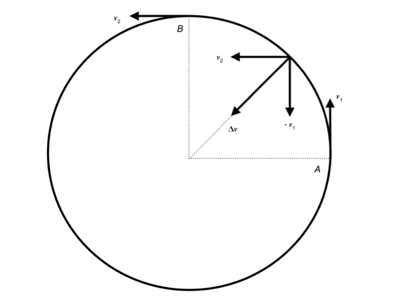
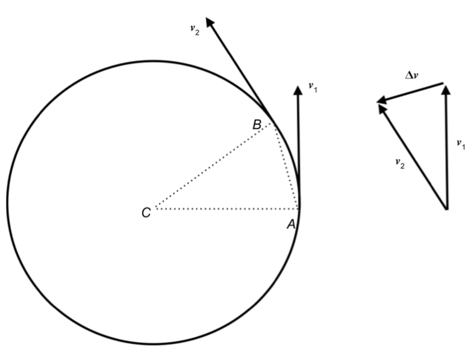

<nav class="packet-nav" aria-label="Packet navigation">
<a href="/aa/ss/2026-2027/">AA:SS class page</a>
<a href="/aa/assignments/x_astrodynamics_1.zip">Download assignment (.zip)</a>
<a href="/">Home</a>
</nav>

* Uniform circular motion
  * orbital speed and period
  * acceleration of the Moon and $1/r^2$ behavior of gravity
* Newton’s Laws of Motion
  * mass and momentum
  * inertial frames of reference
  * Newton I–III
* Newton’s Law of Universal Gravitation
  * surface gravity
  * standard gravitational parameter
  * geostationary and geosynchronous orbits

# Newtonian Dynamics

In class, we have been discussing Newton’s laws of motion and gravitation. Let us recall that

* **mass** is the modern term for Newton’s notion of *quantity of matter* that he defined to be in direct proportion to density and bulk.
* (linear) momentum is the modern term for what Newton called *quantity of motion* that he defined to be in direct proportion to mass and **velocity**.

The **velocity** of an object is the rate of change of its **position**. We write this as

$$
\vec{v} = \frac {d\vec{x}}{dt} \tag{1}
$$

or $\vec{v} = \frac{\Delta \vec{x}}{\Delta t}$ if you are more comfortable with this notation. The bold font indicates that we are talking about both direction and magnitude; this is an example of a **vector**. The notation $v=||\vec{v}||$ means that we are taking only the magnitude of the velocity vector, which is called the **speed**. The dimensions of velocity and speed are both $\frac LT$.

The (linear) momentum of an object is denoted by $\vec{p}$. According to Newton’s definition, if an object has some mass $m$ and velocity $\vec{v}$, then[1](#fn:1)

$$
\vec{p}=m \vec{v}	\tag{2}
$$

Recall that a frame of reference is **inertial** provided it is moving at constant velocity with respect to a frame that is absolutely at rest.

>**Newton’s First Law:** Inertial frames of reference exist.

Since $\vec{v}$ is a vector, a frame can fail to be inertial because it’s speed $v$ is changing and/or because the *direction* of motion is changing. The rate of change of the velocity of an object is called its **acceleration**:

$$
\vec{a}=\frac {d\vec{v}}{dt}	\tag{3}
$$

(Take care to not confuse Its magnitude $a=||\vec{a}||$ with the size of the semi-major axis of an ellipse!)

> **Newton’s Second Law:** *In an inertial frame of reference*, the rate of change of the momentum $\vec{p}$ of an object is equal to the **net force** acting on that object:

$$
\vec{F}_{net}=\frac {d\vec{p}}{dt}	\tag{4}
$$

Here the net force $\vec{F}_{net}$ denotes the sum of all the forces acting on that object. If there are $N$ distinct forces acting, we denote this as

$$
\vec{F}_{net}=\sum_{i=1}^N \vec{F}_i=\vec{F}_1+\vec{F}_2+\dots+\vec{F}_N
$$

Often, the mass of the object under consideration is constant in time. When this is true, then the change in the momentum of an object can only be coming from a change in the velocity: $\vec{p}=m\vec{v}$. In this case, Newton’s Second Law reduces to

$$
\vec{F}_{net}=m \vec{a}	\tag{4’}
$$

We round out these laws of motion with

>**Newton’s Third Law:** If an object $A$ acts on another object $B$ with a force $\vec{F}_{AB}$, then $B$ will act on $A$ with a force $\vec{F}_{BA}$ such that

$$
\vec{F}_{BA}= -\vec{F}_{AB}	\tag{5}
$$

This means that the magnitude of the force of $B$ on $A$ is the same at that of $A$ on $B$, but the direction is opposite. This is often referred to as “equal and opposite forces”.

# Uniform Circular Motion

In this section, we will work out various results that follow from Newton’s dynamical laws for circular orbits.

**Centripetal acceleration**

> ### Problem 1.
>
> Suppose an object is moving in a circle of radius $r$ with a constant speed $v$. This is called **uniform circular motion**.
>
> a. Argue that the acceleration of the object is not zero and try to find the direction in which the acceleration points.
>
> b. Using dimensional analysis, write a formula for the acceleration of the object as a function of $v$ and $r$.
>
> c. Using geometry, derive a formula relating the period $P$ (the time it take the object to go around the circle once) to $v$ and $r$.

We will now explain in more detail where this result comes from. Consider the diagram below describing uniform circular motion. When the particle is at the point labeled $A$, it has velocity $\vec{v}_1$ and when it is at the point labeled $B$ it has velocity $\vec{v}_2$. Uniform circular motion means that the speed $v_1=||\vec{v}_1||$ at $A$ and the speed $v_2=||\vec{v}_2||$ at $B$ are equal. We will call the speed $v$, so both $v_1=v$ and $v_2=v$, but the directions are *not* the same.

The rest of the diagram is supposed to show how the velocity vector changed. Define the change in vector $\Delta \vec{v}=\vec{v}_2-\vec{v}_1$. To visualize it, we have moved $\vec{v}_2$ to the point on the circle midway between $A$ and $B$. Similarly we have moved $\vec{v}_1$, but we have also flipped it over to represent $-\vec{v}_1$. Vectors are added “tip to tail”, so the sum of the two vectors gives the size and direction of the vector $\Delta\vec{v}=\vec{v}_2-\vec{v}_1$.

Now recall that the acceleration vector [(3)](#a) is in the direction of $\vec{v}$, which is pointing directly toward the center of the circle. Such a direction is called **centripetal**-meaning toward the center-so the acceleration of a particle in uniform circular motion is centripetal.

The size of the centripetal acceleration is often denoted $a_c$. Dimensional analysis implies that $a_c\propto v^2/r$. We will now show that, in fact

$$
a_c=\frac{v^2}r	\tag{10}
$$

The derivation of this rule is a neat argument given presently based on the similarity of two triangles with entirely different meanings. If you are willing to accept this as a fact, you can skip the derivation.

Consider the diagram above in which we study the change in position of a particle in uniform circular motion from the point $A$ to $B$. As before, the velocity changes from $\vec{v}_1$ to $\vec{v}_2$. On the right, we have constructed a triangle from these two vectors together with their difference $\Delta \vec{v}$. The key is to note that this triangle is similar to the triangle $ABC$. This implies that the ratio $\frac{\Delta v}{v_1}$ is equal to the ratio of the lengths of $AB$ to $CA$. Now the size of $\vec{v}_1$ is $v$, and the length of $CA$ is the radius $r$ of the circle, so if we can figure out what the length is of $AB$, then we can calculate the size of the centripetal acceleration $a_c=\frac {\Delta v}{\Delta t}$. This is not difficult to calculate if we note that the length of $AB$ is very nearly the arclength that the particle travels in going from the point $A$ on the circle to the point $B$ on the circle. This length is given by the speed the particle is traveling, namely $v$, times the time $\Delta t$ that it takes to do so. Thus the ratio of the lengths of  $AB$ and $CA$ is very nearly $\frac {v\Delta t}r$, and the approximation gets better as we take ever smaller time intervals $\Delta t$.

We conclude that by similarity of the velocity triangle and the spatial triangle, $\frac{\Delta v}v\approx \frac{v\Delta t}r$. Rearranging gives the acceleration $a_c=\frac{\Delta v}{\Delta t}\approx \frac{v^2}r$ with the approximation getting ever better as $\Delta t\to 0$. This demonstrates that the exact formula for the centripetal acceleration is given by equation ([10](#eq:a_c)).

> ### Problem 2.
>
> In the Aristarchus packet, you calculated the distance to the Moon. The modern value of this distance is $r\approx 380,000\ km$.
>
> a. Calculate the acceleration due to gravity that the Moon is experiencing.
>
> b. By what factor is this answer smaller than $g$? Take the reciprocal of this number and round it to 2 significant digits. What do you notice about it? Hint: Is it a square?

Ptolemy had given the distance to the Moon as 59 times the radius of Earth. He determined this using the parallax of the Moon as seen from two different points on Earth.

> ### Problem 3.
>
> Suppose you and a friend observe the Moon from opposite sides of the Earth. Assuming Ptolemy was right about the ratio of the distance to the Moon with the radius of the Earth, show that the angle of parallax between your observations is $1.9^\circ$.
>
>> Hint: Draw a diagram that represents the act of looking at something from two different sides of the Earth. Label the Earth’s radius $R_\oplus$, distance to the Moon $r_{moon}$, and the angle of parallax $\theta$.

> ### Problem 4.
> Look back carefully at your result from problem 2b.
>
> a. Argue, as Newton did, that this and Ptolemy’s result together suggest that the force of gravity between the Earth and the Moon is inversely proportional to the square of the distance between them.

# Newton’s Law of Universal Gravitation

The laws of Newtonian dynamics describe how forces behave and how they give rise to the (changes in) motion of particles. Nowhere in those rules, however, has it been explained how forces arise. One familiar force is the force of gravity that makes things fall down. Newton extended this notion to all objects in the Universe in his

>**Law of Universal Gravitation (LUG):** Any object in the Universe attracts any other object in the Universe with a force that is proportional to the product of their masses and inversely proportional to the square of the distance between them.

In formulaic terms, for any two objects with masses $m_1$ and $m_2$ separated by a distance $r$, the magnitude of the gravitational force between them is given by

$$
F_{gravity}=G \frac{m_1 m_2}{r^2}	\tag{6}
$$

The constant $G$ is called Newton’s constant. The claim Newton makes is that it is a **fundamental constant** of Nature having the same value *anywhere* according to any intertial observer in the Universe. The modern value of this constant is

$$
G=6.67\times 10^{-11} \frac {m^3}{kg \cdot s^2}	\tag{7}
$$

In class, we used both Newton II (eq. [4'](#fma)) and the Law of Universal Gravitation (LUG) in equation [(6)](#lug) to calculate the surface gravity $g=9.8 m/s^2$. The logic was that if an object of mass $m$ is subject only to the gravitational attraction of the Earth, then Newton II says it will accelerate downward at a rate $a=F_{gravity}/m$, but the LUG implies that $F_{gravity}=G \frac{m M}{R^2}$. Plugging this in, we find that the acceleration is $a=\frac 1m F_{gravity}=\frac 1m G \frac{m M}{R^2}=\frac{GM}{R^2}$. The values $R=6,400 km$ and $M=6.0\times 10^{24} kg$ were used in problem 5 of the `x_dimensional_analysis` packet. Remembering to convert $1km =1000 m$ because the gravitational constant [(7)](#G) is in SI units, we find for the acceleration near the surface of the Earth

$$
g=\frac{GM}{R^2} \approx 9.8 \frac m{s^2} 	\tag{8}
$$

(It is conventional to call the surface gravity $g$.)

> ### Problem 5.
>
> Look up the mass and radius of the Moon, Mars, and Ceres, and use those to *calculate* the surface gravity of these celestial bodies.
>
>
>> Hint: You can import the values of the radii and masses of these bodies from the Python package `astroc` In the code block below, Python is importing these values as `M_moon`, `R_moon`, etc. (from a packet called `astroc` inside of a folder called `aa_tools`). You can use a print command to get their values in SI units (don't forget to write the units). You can also define a function, say `g(M,R)` to calculate the surface gravities for you. Once you have done this, you can call the function again later if needed. (Hint: It will come in handy later.) I highly recommend you invest some time to do the problem this way. Please ask me if you want to but don't know how.

|  | mass (  ??   ) | radius (  ??   ) | $g   (m/s^2)$ |
| :---: | :---: | :---: | :---: |
| Moon |  |  |  |
| Mars |  |  |  |
| Ceres |  |  |  |

> ### Problem 6.
>
> Suppose an object is an altitude $h$ above the surface of the Earth. Convince yourself that the acceleration due to gravity at that altitude is $a(h)=\frac{GM_\oplus}{(R_\oplus+h)^2}$.
>
> a. The altitude of the ISS is $h=400 km$. Calculate the acceleration due to gravity that the ISS is experiencing at that altitude. Is this value small?
>
> b. The acceleration due to gravity of the ISS is not small. Why doesn’t it come crashing down? Why does it look like the astronauts inside are floating freely instead of falling down?

In general, the acceleration due to gravity at a distance $r$ from the center of a body of mass $M$ is

$$
a(r)=\frac{GM}{r^2}	\tag{9}
$$

This assumes that $r$ is larger than the radius of the body (otherwise we would be *inside* the body).

> ### Problem 7.
>
> Why could Newton not have gotten the $1/r^2$ behavior simply from dimensional analysis?

### Dynamical properties of circular orbits

When a body of mass $m$ is orbiting a much more massive object with mass $M$, the former is called the **secondary body** and the latter is called the **primary body**. For example, in the Earth-ISS system, Earth is the primary body and the ISS is the secondary.

> ### Problem 8.
>
> Consider the case of an object orbiting a much more massive primary with mass $M$ on a circular orbit of radius $r$.
>
> a. Combine the formula ([9](#eq:a(r))) for the acceleration due to gravity with the formula we found for the centripetal acceleration ([10](#eq:a_c)) to show that the speed of the secondary is

$$
v_{orbit}=\sqrt{\frac {GM}r} \tag{11}
$$

>
> b. For an object traveling in uniform circular motion with speed $v$ and radius $r$, the period $P$ of the motion is the time it takes for the object to travel the circumference $2\pi r$. Since its speed is $v$, this means $P=\frac{2\pi r}v$. Use this to show that the period of secondary is

$$
P=2\pi \sqrt{\frac{r^3}{GM}} \tag{12}
$$

>
> c. The mass of the Sun $M_\odot \approx 2.0\times 10^{30} kg$ and the radius of the Earth’s nearly-circular orbit (eccentricity $e\approx 0.02$) is 150 million kilometers. Calculate the speed of the Earth in its orbit around the Sun and the time it takes to make one revolution. (Remember that if you want to use the number in ([7](#G)), you need to convert to SI units\!)

> ### Problem 9.
>
> Sometimes it is useful to be able to calculate the radius of a circular orbit from its period and the mass of the primary.
>
> a. Derive such a formula by solving [(12)](#eq:P) for the radius $r$.
>
> If a satellite is close to Earth, it will orbit faster than the Earth is spinning. If it is very far away like the Moon, it will orbit more slowly. A **geosynchronous orbit** is an orbit on which the satellite revolves at the same rate as the Earth rotates.
>
> b. Using the mass of the Earth $M_\oplus \approx 6.0\times 10^{24}\ kg$ quoted previously *and without looking anything else up*, find the radius of a geosynchronous orbit.
>
> c. Write your answer from part b in terms of Earth radii (recall $R_\oplus \approx 6,400\ km$).
>
> d. Argue that if you want a satellite to stay directly overhead of a single point on Earth, then you should put it in an orbit in the equatorial plane at the distance you calculated in part b.

The orbit you found in part d is called a [geostationary orbit](https://en.wikipedia.org/wiki/Geostationary_orbit), or if that’s not fancy enough for you, a "geosynchronous equatorial orbit". Satellites in [geosynchronous orbits](https://en.wikipedia.org/wiki/Geosynchronous_orbit) that are not equatorial will return periodically to being directly overhead of certain points every 23 hours, 56 minutes, and 4 seconds (*i.e.* the length of a sidereal day).

Next, let’s return to discussing Kepler’s Laws for circular orbits. The first law holds because a circle is a special kind of ellipse (to wit, one with $e=0$). The second law is also easy for circles since since the radius us constant, and we already concluded that the speed is constant, so the area swept out per unit time will also be constant.

> ### Problem 10.
>
> Prove Kepler’s Third Law for circular orbits. What is meaning of the constant $K$ in the formula $P^2/r^3=K$ from the last packet? Derive a formula for the mass of a primary from the period and radius of the orbit of a secondary body around it.

The result of this problem suggests a method to determine the mass of a celestial object by studying the motion of anything orbiting it. Interestingly, this is the only known method to accurately determine the masses of celestial bodies. Also important is that what the method actually gives you is the combination $GM$ and not $M$ directly. The combination $\alpha=GM$ is called the [standard gravitational parameter](https://en.wikipedia.org/wiki/Standard_gravitational_parameter). It is known more precisely than the mass itself because we are good at measuring large distances and times, but $G$ itself is very difficult to measure, so it will have a larger uncertainty. Because of this, a sizable uncertainty for the standard gravitational parameter $\alpha$ becomes a sizable uncertainty for $M_\odot$.

> ### Problem 11.
>
> Mars has two moons called Phobos (a.k.a. Mars I) and Deimos (a.k.a. Mars II). Deimos’ orbit is circular ($e=0.0003$) with a radius of $23,460\ km$ and a period of $30.3\ hr$.
>
> a. Calculate the standard gravitational parameter of Mars. (Don’t forget units!)
>
> b. Phobos orbits Mars in just 7 hours and 39 minutes. Calculate the radius of its orbit.
>
> c. In terms of Mars radii ($R_{Mars}=3,400\ km$), how big are these orbital radii? How do they compare to the Earth-Moon system?

1:  If you are paying very close attention, you may object that we only know that momentum is *proportional* to the product of the mass and the velocity. However, since we are introducing the concept of momentum here, the constant of proportionality can be chosen to be 1\. (If it weren’t, say it were 5, you can just redefine all momenta by that factor of 5.)
