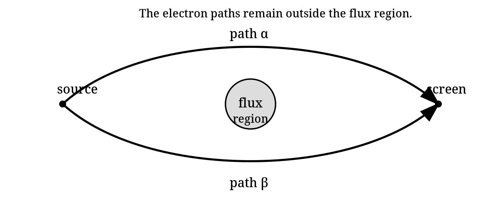
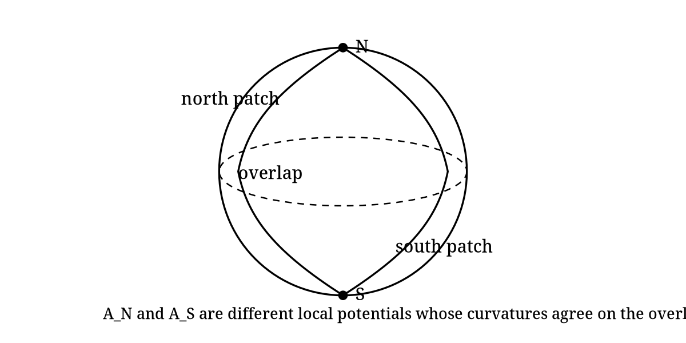

::: {.callout-important title="How to use this packet"}
This is not an introductory reading. It is a guided derivation packet. The calculation is the main way the student learns the ideas.

The packet is designed around attempt, obstruction, repair, and reinterpretation. Work through the problems actively; most of the concepts are introduced because a calculation forces them to appear.
:::

## Orientation

Modern physics describes the fundamental interactions, in modern language, using gauge fields and closely related geometric structures. That slogan is deliberately simple. Gravity requires qualifications, because it is usually introduced as spacetime geometry rather than as an ordinary Yang--Mills gauge field. The purpose of the slogan is not to settle every technical qualification at the beginning; its purpose is to point toward the structure we are going to uncover.

The destination is visible from the beginning:

$$
\begin{array}{c}
\text{local quantum phase}\\[3pt]
\Downarrow\\[3pt]
\text{covariant derivative}\\[3pt]
\Downarrow\\[3pt]
\text{connection}\\[3pt]
\Downarrow\\[3pt]
\text{curvature}\\[3pt]
\Downarrow\\[3pt]
\text{field strength and holonomy}\\[3pt]
\Downarrow\\[3pt]
\text{gauge-invariant dynamics.}
\end{array}
$$

We will not begin with principal bundles. We will also not begin by classifying all forces. The quickest honest entrance is a small quantum-mechanical annoyance: multiplying a wavefunction by an unobservable phase does not change probabilities, but derivatives notice if the phase varies from point to point. The first part of the packet makes you repair that failure. Only after the repair has been forced will we name it geometrically.

The one-component case is the abelian training case. The two-component nonabelian case will then be built from matrices that preserve a Hermitian inner product. Only after that will we specialize to the determinant-one subgroup and the Pauli matrices. Standard Model and condensed-matter directions are saved for the end as a map of nearby territory.

## What you need to know

You should be comfortable with complex numbers, partial derivatives, matrix multiplication, Hermitian inner products, and basic quantum wavefunctions. You do not need prior knowledge of quantum field theory, principal bundles, differential forms, Lie groups, Yang--Mills theory, or the Standard Model.

That last sentence has consequences for the packet. We will not use words such as $U(1)$, $U(2)$, $SU(2)$, curvature, Hodge star, or Lie algebra as if they are already familiar. Each one will appear only after a calculation creates a reason to name it. Differential forms require a little compact machinery, so a short appendix on $dx^\mu$, wedge products, $\epsilon$, the spacetime metric, volume forms, and the Hodge star is included near the end. The main text will introduce just enough of that language when it is first used.

We will use units and conventions chosen to expose the geometry rather than obscure it with constants. In particular, the connection one-form will be normalized so that its integral along a path is a phase. Constants and charge normalizations are not part of the first-pass structure.

## Phase is not a name; it is a consequence

It is tempting to start by saying that a wavefunction may be multiplied by a phase. But for this packet, even that should be earned. Start with a complex scalar wavefunction $\psi(x)$ and ask which complex numbers can multiply it without changing the pointwise density.

::: {.callout-note title="Problem 1: Derive phases from density preservation"}
Let $z\in\mathbf{C}$ be a nonzero complex number and define

$$
\psi'(x)=z\psi(x).
$$

1. Compute $\overline{\psi'}\psi'$ in terms of $\bar\psi\psi$ and $z$.
2. Find the condition on $z$ that makes $\overline{\psi'}\psi'=\bar\psi\psi$ for every $\psi$.
3. Show that every such $z$ can be written as $z=e^{i\alpha}$ for some real $\alpha$, at least up to adding multiples of $2\pi$.

The set of complex numbers satisfying this condition is called $U(1)$. At this point, that name only means "unit complex numbers under multiplication." Note that $\alpha$ parameterizes a circle, since $\alpha$ is identified with $\alpha+2\pi$. We say that $U(1)$ is 1-dimensional and has the topology of a circle. We write this as $U(1)\cong S^1$.
:::

The previous problem did not use derivatives. It only used the Hermitian square of the wavefunction. Nothing in that argument required the same phase choice at every point. So now make the phase local and see what breaks.

::: {.callout-note title="Problem 2: Local phase leaves the density alone, but derivatives notice"}
Let $\alpha(x)$ be a real-valued function and let

$$
\psi'(x)=e^{i\alpha(x)}\psi(x).
$$

1. Show directly that $\overline{\psi'}\psi'=\bar\psi\psi$ pointwise.
2. Compute $\partial_\mu\psi'$ using the product rule.
3. Identify exactly which term prevents $\partial_\mu\psi$ from transforming in the same way as $\psi$.
:::

The failure is not philosophical; it is a product-rule term. This is why the next step should not be memorized. You can force it. We look for a new derivative that absorbs the unwanted term and therefore transforms the way the field itself transforms.

::: {.callout-note title="Problem 3: Force the covariant derivative"}
Define a modified derivative by

$$
D_\mu\psi=(\partial_\mu-iA_\mu)\psi.
$$

Assume $\psi'=e^{i\alpha}\psi$. Find the transformation law for $A_\mu$ that makes

$$
D'_\mu\psi'=e^{i\alpha}D_\mu\psi.
$$

Do not guess the sign. Compute it.
:::

## Conventions after the first obstruction

Now that $A_\mu$ and $D_\mu$ have appeared, we collect the conventions that will be used from here onward.

The basic local expression is

$$
D_\mu=\partial_\mu-iA_\mu.
$$

The one-component local gauge transformation is

$$
\psi\mapsto \psi'=e^{i\alpha}\psi,
\qquad
A_\mu\mapsto A'_\mu=A_\mu+\partial_\mu\alpha.
$$

The expression above uses the common physics normalization in the one-component abelian case: the local potential $A_\mu$ is real-valued and

$$
D_\mu=\partial_\mu-iA_\mu.
$$

Equivalently, the mathematical local connection one-form is anti-Hermitian-valued:

$$
A_{\mathrm{conn}}=-iA_{\mathrm{phys}},
\qquad
A_{\mathrm{phys}}=A_\mu dx^\mu.
$$

When the distinction matters, $A_{\mathrm{phys}}$ denotes the real abelian physics potential and $A_{\mathrm{conn}}$ denotes the anti-Hermitian connection form. Most of the packet suppresses these subscripts and uses straight $A$ and $F$ for the connection-like object and its curvature in the context at hand. The point is continuity, not a new notation.

In the nonabelian section the same symbol $A$ becomes Lie-algebra-valued, and with anti-Hermitian generators the covariant derivative has the clean form

$$
D=d+A,
\qquad
F=dA+A\wedge A.
$$

This is not a new concept. It is the same connection idea written in the convention that generalizes cleanly from the one-component phase case to $SU(2)$. Physicists often say that $A$ is the connection. The more precise mathematical statement is that $D$ is the connection, while $A$ is a local connection one-form after choosing a gauge or local trivialization.

The real abelian one-form is normalized so that its line integral gives a phase. Its components carry whatever inverse-coordinate dimensions are needed so that the integral is dimensionless. We will not insert charge parameters or unit-system constants into the first definition of $D_\mu$.

For spacetime index contractions we use the mostly-plus convention

$$
\eta_{\mu\nu}=\mathrm{diag}(-1,+1,+1,+1).
$$

This metric is what raises and lowers spacetime indices such as $\mu,\nu$. It is not the same structure as the Hermitian inner product on the representation space or the invariant inner product on a Lie algebra.

A complex scalar field will be used as the working matter field. This is not a realistic electron. Real electrons are spinor fields. A scalar field isolates the gauge idea without forcing us to introduce spinors, gamma matrices, or Lorentz representation theory.

## First gauge-invariant building blocks

The covariant derivative is useful because it transforms like the field. But physics is not made only from covariant objects. Local observable quantities and Lagrangian densities must be gauge-invariant. The first examples are deliberately simple. In this section the raised spacetime index in $D^\mu$ is raised with the mostly-plus spacetime metric stated above.

::: {.callout-note title="Problem 4: Construct the first gauge-invariant local scalar"}
Assume $D_\mu\psi$ transforms covariantly:

$$
D_\mu\psi\mapsto e^{i\alpha}D_\mu\psi.
$$

Show that

$$
\overline{D_\mu\psi}\,D^\mu\psi
$$

is invariant under the local phase transformation. Then explain why $\bar\psi\psi$ and $\overline{D_\mu\psi}\,D^\mu\psi$ are different kinds of local gauge-invariant building blocks.
:::

## Curvature from the commutator of covariant derivatives

A covariant derivative tells us how to compare nearby values of a field. The next question is whether comparisons commute. If we move first in the $\mu$ direction and then in the $\nu$ direction, do we get the same result as moving in the opposite order?

The failure of covariant derivatives to commute is the curvature. In electromagnetism this curvature is the field strength.

::: {.callout-note title="Problem 5: Compute the abelian curvature $F_{\mu\nu}$"}
For the one-component covariant derivative

$$
D_\mu=\partial_\mu-iA_\mu,
$$

compute $[D_\mu,D_\nu]\psi$ explicitly. Show that it can be written as

$$
[D_\mu,D_\nu]\psi=-iF_{\mu\nu}\psi
$$

and identify $F_{\mu\nu}$.
:::

::: {.callout-note title="Problem 6: Gauge invariance of the abelian field strength $F_{\mu\nu}$"}
Use

$$
A'_\mu=A_\mu+\partial_\mu\alpha
$$

and

$$
F_{\mu\nu}=\partial_\mu A_\nu-\partial_\nu A_\mu
$$

to show that $F'_{\mu\nu}=F_{\mu\nu}$.
:::

## A short bridge to differential forms

The packet promised not to assume differential forms. We now need a small amount of form language because it is the natural way to express curvature and holonomy. The appendix gives a fuller reference, but the essential rules are these.

The symbols $dx^\mu$ are basis one-forms. A one-form looks locally like

$$
A=A_\mu dx^\mu.
$$

The wedge product is antisymmetric:

$$
dx^\mu\wedge dx^\nu=-dx^\nu\wedge dx^\mu,
\qquad
dx^\mu\wedge dx^\mu=0.
$$

The exterior derivative turns a one-form into a two-form:

$$
d(A_\mu dx^\mu)=(\partial_\nu A_\mu)dx^\nu\wedge dx^\mu.
$$

This is not new physics. It is a compact way to store antisymmetric component information.

::: {.callout-note title="Problem 7: Recover the components of $F$ from $F=dA$"}
Starting from

$$
A=A_\mu dx^\mu,
$$

compute $dA$ and show that

$$
dA=\frac12(\partial_\mu A_\nu-\partial_\nu A_\mu)dx^\mu\wedge dx^\nu.
$$

Then explain why this agrees with the curvature found from $[D_\mu,D_\nu]$.
:::

Before the next problem, we need one more rule of form calculus. The exterior derivative satisfies

$$
d^2=0.
$$

For an ordinary scalar function this is the statement that mixed partial derivatives commute, packaged antisymmetrically. For example, if $A=A_\mu dx^\mu$, then $d(dA)$ contains terms proportional to

$$
\partial_\lambda\partial_\mu A_\nu\,dx^\lambda\wedge dx^\mu\wedge dx^\nu,
$$

and the symmetric second derivatives are killed by the antisymmetric wedge product.

::: {.callout-note title="Problem 8: The abelian Bianchi identity $dF=0$"}
Use $F=dA$ and $d^2=0$ to prove

$$
dF=0.
$$

Then show that this is equivalent to the component identity using antisymmetrization over three indices:

$$
\partial_{[\lambda}F_{\mu\nu]}=0.
$$

(The antisymmetric part of an object $X_{\mu_1 \dots \mu_p}$ is denoted $X_{[\mu_1 \dots \mu_p]}$. It is the average over all signed permutations of the displayed indices, with an overall factor of $1/p!$. For example, $T_{[\mu\nu]}=\frac12(T_{\mu\nu}-T_{\nu\mu})$.)

Finally, choose the oriented coordinate volume form

$$
\mathrm{vol}=dt\wedge dx\wedge dy\wedge dz
=dx^0\wedge dx^1\wedge dx^2\wedge dx^3.
$$

We define the upper-index Levi-Civita symbol by

$$
\epsilon^{0123}=+1,
$$

with antisymmetry determining all other components. Thus

$$
dx^\mu\wedge dx^\nu\wedge dx^\rho \wedge dx^\sigma= \epsilon^{\mu\nu\rho\sigma}\,\mathrm{vol}.
$$

Show that the same identity may be written in the equivalent form

$$
\epsilon^{\mu\nu\rho\sigma} \partial_\rho F_{\mu \nu}=0.
$$

Because we use mostly-plus signature, lowering all four indices gives $\epsilon_{0123}=-1$. The appendix explains this sign.
:::

The identity $dF=0$ did not need a metric. It followed from $F=dA$ and $d^2=0$. The other half of Maxwell theory needs more structure. To write the sourced field equation, spacetime must supply a metric, an orientation, and therefore a volume form. These let us define the Hodge star $*$, which turns a two-form in four dimensions into another two-form.

With that extra structure, the sourced field equation can be written as the differential-form equation

$$
d(*F)=j.
$$

Here $j$ is a current three-form. The equation is compact, but it is not magic: the star is where the spacetime metric and orientation enter. The appendix gives the component rules and the role of $\epsilon^{\mu\nu\rho\sigma}$.

::: {.callout-note title="Problem 9: Locate the metric in $d(*F)=j$"}
The equation

$$
dF=0
$$

can be written without a metric. The equation

$$
d(*F)=j
$$

cannot.

1. Explain why $dF=0$ only needs the exterior derivative.
2. Explain why $*F$ requires a spacetime metric and an orientation.
3. In four spacetime dimensions, if $F$ is a two-form, what degree form is $*F$? What degree form is $d(*F)$?
:::

## Wilson lines and the Aharonov--Bohm rest stop

The local field strength $F$ is gauge-invariant in the abelian theory, but the connection also controls how phase is transported along paths. This is where the Aharonov--Bohm effect becomes a useful rest stop.

The point is not to make the vector potential "more real" than the field strength. The point is subtler: a connection compares phase along a path, and a closed path can remember something global about the region it encloses.

{fig-alt="Two paths from a source to a screen passing around an excluded flux region."}

::: {.callout-note title="Problem 10: Gauge transformation of a Wilson line $W(\gamma)$"}
For an oriented path $\gamma$ from point $p$ to point $q$, define the abelian Wilson line

$$
W(\gamma)=\exp\left(i\int_\gamma A\right).
$$

Under the gauge transformation $A\mapsto A+d\alpha$, show that

$$
W(\gamma)\mapsto e^{i\alpha(q)}W(\gamma)e^{-i\alpha(p)}.
$$

Then conclude that $W(\gamma)$ is gauge-invariant when $\gamma$ is closed.
:::

::: {.callout-note title="Problem 11: Flux from holonomy with the orientation made explicit"}
Let $\gamma=\partial\Sigma$ be the oriented boundary of an oriented surface $\Sigma$. Stokes' theorem says

$$
\oint_{\partial\Sigma}A=\int_\Sigma dA.
$$

1. Use $F=dA$ to show

$$
\oint_\gamma A=\int_\Sigma F.
$$

2. Suppose two paths $\alpha$ and $\beta$ go from the same initial point $p$ to the same final point $q$. Define the closed loop

$$
\gamma=\beta\circ\alpha^{-1},
$$

meaning: traverse $\alpha$ backward and $\beta$ forward. Show that

$$
\oint_\gamma A=\int_\beta A-\int_\alpha A.
$$

3. In the Aharonov--Bohm setup, explain why this formula lets a wavefunction detect an inaccessible flux region even when the local field strength vanishes along the particle's path.
:::

## From one component to two: discovering unitary transformations

The one-component theory began with complex numbers preserving $\bar\psi\psi$. The two-component theory should begin the same way. Do not start with the name of a group. Start with a vector, a Hermitian inner product, and a transformation that preserves it.

Let the same field symbol $\psi(x)$ now denote a two-component internal vector:

$$
\psi(x)=\begin{pmatrix}\psi^1(x)\\ \psi^2(x)\end{pmatrix}.
$$

The index $i=1,2$ labels components in an internal representation space $V\cong\mathbf{C}^2$. It is not a spacetime index and it is not a spin index in this packet.

The Hermitian inner product on $V$ is

$$
\langle \psi,\chi\rangle_V=\bar\psi_i\chi^i.
$$

Here $\bar{\psi^i}$ denotes the ordinary complex conjugate of the complex number $\psi^i$, while $\bar\psi_i$ denotes the adjoint component with respect to the Hermitian inner product. In an orthonormal basis these may have the same numerical entries, but they play different geometric roles.

::: {.callout-note title="Problem 12: Derive $U^\dagger U=\mathbf{1}$ from inner-product preservation"}
Let

$$
{\psi'}^i=U^i{}_j\psi^j,
$$

where $U$ is a complex $2\times2$ matrix. Require the Hermitian inner product to be preserved for all $\psi,\chi\in\mathbf{C}^2$:

$$
\langle U\psi,U\chi\rangle_V=\langle\psi,\chi\rangle_V.
$$

1. Show that this condition implies

$$
U^\dagger U=\mathbf{1}.
$$

2. Matrices satisfying this condition are called **unitary**. They form a group called $U(2)$. Determine the number of real parameters in a general element of $U(2)$.
3. Show that if $U=e^{i\alpha}\mathbf{1}$, this contains the one-component phase rotation from the earlier abelian theory as a special case.
4. Imposing $\det U=1$ gives the subgroup called $SU(2)$. Show that every element of $SU(2)$ can be written as

$$
U=
\begin{pmatrix}
a & b\\
-\bar b & \bar a
\end{pmatrix},
\qquad
|a|^2+|b|^2=1.
$$

How many real parameters are required?
:::

The nomenclature is as follows. The letter $U$ means unitary. The word **special** means determinant one. The group $SU(2)$ is therefore the special unitary subgroup of $U(2)$.

A **group** is the collection of full transformations, such as the matrices $U$ acting on $\psi$. Here "full" means finite rather than infinitesimal; it does not mean that the collection has only finitely many elements. A **representation** is the rule by which those group elements act on a vector space such as $V\cong\mathbf{C}^2$. A **Lie algebra** is the infinitesimal version of the group: it records the directions in which one may move away from the identity element. We will keep these three notions separate.

The notation $\mathfrak{su}(2)$ is part of a standard typographical convention. Lie groups are often written with capital Roman letters, such as $SU(2)$, while their Lie algebras are written with lowercase fraktur letters, such as $\mathfrak{su}(2)$. The fraktur font is not decoration. It is a warning label: $SU(2)$ is the group of transformations, while $\mathfrak{su}(2)$ is the vector space of infinitesimal generators together with a bracket operation. The exponential map connects the two stories locally: an infinitesimal generator $X\in\mathfrak{su}(2)$ produces group elements such as $e^X\in SU(2)$. But the group and the Lie algebra are not the same kind of object.

For a matrix group, the Lie algebra of $SU(2)$ is the space of traceless anti-Hermitian matrices. That convention is the standard mathematical one. It differs from a common physics convention in which the Pauli matrices divided by $2$ are called generators even though they are Hermitian. In this packet we use the anti-Hermitian basis

$$
t_a=-\frac{i}{2}\sigma_a.
$$

Then $t_a^\dagger=-t_a$, $\mathrm{tr}(t_a)=0$, and $t_a\in\mathfrak{su}(2)$. The Pauli matrices themselves are

$$
\sigma_1=\begin{pmatrix}0&1\\1&0\end{pmatrix},\qquad
\sigma_2=\begin{pmatrix}0&-i\\i&0\end{pmatrix},\qquad
\sigma_3=\begin{pmatrix}1&0\\0&-1\end{pmatrix}.
$$

They are familiar from spin, but here they act on the two-dimensional internal label of the components $\psi^i$, not necessarily on spin-up and spin-down states.

::: {.callout-note title="Problem 13: Pauli matrices and anti-Hermitian generators"}
Define

$$
t_a=-\frac{i}{2}\sigma_a.
$$

1. Show that each $t_a$ is anti-Hermitian and traceless.
2. Compute enough products of Pauli matrices to show

$$
[\sigma_a,\sigma_b]=2i f_{ab}{}^c\sigma_c,
$$

where $f_{12}{}^3=f_{23}{}^1=f_{31}{}^2=1$ and the coefficients are antisymmetric in the lower labels.
3. Use this to prove

$$
[t_a,t_b]=f_{ab}{}^c t_c.
$$

What changed when we passed from the Hermitian matrices $\sigma_a/2$ to the anti-Hermitian basis $t_a$?
:::

::: {.callout-note title="Problem 14: Write the $SU(2)$ covariant derivative with all indices visible"}
Let the local connection one-form be anti-Hermitian-valued:

$$
A_\mu=A_\mu^a t_a,
\qquad
(A_\mu)^i{}_j=A_\mu^a(t_a)^i{}_j.
$$

Define

$$
(D_\mu\psi)^i=\partial_\mu\psi^i+(A_\mu)^i{}_j\psi^j.
$$

1. Explain which indices are spacetime indices, which are internal representation indices, and which are Lie-algebra basis labels. Explicitly state the range of each type of label.
2. Temporarily enlarge from $SU(2)$ to $U(2)$. Show that if $A_\mu$ were proportional to the central anti-Hermitian identity direction $i\mathbf{1}$, this would reduce to two copies of the abelian phase-connection formula.
3. Explain why a general $SU(2)$ connection can mix $\psi^1$ and $\psi^2$.
:::

::: {.callout-note title="Problem 15: Derive the nonabelian gauge transformation law"}
Let $\psi'=U\psi$, where $U(x)\in SU(2)$, and let

$$
D_\mu=\partial_\mu+A_\mu,
\qquad
D'_\mu=\partial_\mu+A'_\mu.
$$

Require

$$
D'_\mu\psi'=U D_\mu\psi.
$$

1. Derive the transformation law

$$
A'_\mu=UA_\mu U^{-1}-(\partial_\mu U)U^{-1}.
$$

2. Explain why this is the nonabelian analogue of the abelian transformation law for the local connection one-form.
:::

::: {.callout-note title="Problem 16: Nonabelian curvature from $[D_\mu,D_\nu]$"}
Using

$$
D_\mu=\partial_\mu+A_\mu,
$$

where $A_\mu$ is matrix-valued, compute $[D_\mu,D_\nu]\psi$ and show that

$$
[D_\mu,D_\nu]\psi=F_{\mu\nu}\psi
$$

with

$$
F_{\mu\nu}=\partial_\mu A_\nu-\partial_\nu A_\mu+[A_\mu,A_\nu].
$$

Then expand $[A_\mu,A_\nu]$ in the $t_a$ basis for $SU(2)$.
:::

::: {.callout-note title="Problem 17: Curvature transforms covariantly"}
Use the transformation law from the previous problem to show that

$$
F'_{\mu\nu}=UF_{\mu\nu}U^{-1}.
$$

A direct component expansion is possible but unpleasant. A cleaner route is to use the operator statement

$$
D'_\mu=U D_\mu U^{-1}.
$$

Apply this to the commutator $[D'_\mu,D'_\nu]$.
:::

The new commutator term is the whole nonabelian story in miniature. Maxwell theory is linear in the potential. Yang--Mills curvature is not. This nonlinearity is one reason nonabelian gauge theories can behave very differently from electromagnetism.

Before discussing dynamics, however, there is another purely geometric identity to prove. In the abelian case it was $dF=0$. In the nonabelian case ordinary $d$ is replaced by the covariant derivative.

::: {.callout-note title="Problem 18: The Jacobi identity for matrix commutators"}
For arbitrary square matrices $X,Y,Z$, prove directly from associativity of matrix multiplication that

$$
[X,[Y,Z]]+[Y,[Z,X]]+[Z,[X,Y]]=0.
$$

Then apply this identity to the basis elements $t_a$ of $\mathfrak{su}(2)$. Using

$$
[t_a,t_b]=f_{ab}{}^c t_c,
$$

show that the Jacobi identity implies the structure-constant identity

$$
f_{[ab}{}^d f_{c]d}{}^e=0.
$$
:::

::: {.callout-note title="Problem 19: The $SU(2)$ Bianchi identity $DF=0$ by explicit calculation"}
For an adjoint-valued field $X=X^a t_a$, define

$$
(D_\lambda X)^a=\partial_\lambda X^a+f_{bc}{}^aA_\lambda^bX^c.
$$

The covariant Bianchi identity is

$$
(D_\lambda F_{\mu\nu})^a+(D_\mu F_{\nu\lambda})^a+(D_\nu F_{\lambda\mu})^a=0.
$$

Use

$$
F_{\mu\nu}^a=\partial_\mu A_\nu^a-\partial_\nu A_\mu^a+f_{bc}{}^aA_\mu^bA_\nu^c
$$

to prove the identity. Organize the calculation into: second-derivative terms, terms with one derivative of $A$ times one $A$, and cubic terms in $A$. Use the Jacobi identity from the previous problem for the cubic terms.
:::

The nonabelian Bianchi identity is the first serious calculation where the pieces must cooperate: spacetime derivatives, matrix commutators, the representation, and the Lie algebra bracket all matter. After doing the indexed calculation, the compressed geometric statement is

$$
DF=0.
$$

In local form notation one writes

$$
F=dA+A\wedge A,
$$

with the understanding that $A$ is matrix-valued and wedge multiplication also includes matrix multiplication.

## Inner products, invariants, and dynamics

The commutator made $\mathfrak{su}(2)$ into a Lie algebra suitable for defining nonabelian curvature. Dynamics requires another structure: a way to pair Lie-algebra-valued objects and produce scalar quantities.

This is where we separate the antisymmetric part of Pauli multiplication from the symmetric part. The commutator gave the Lie bracket. The anticommutator reveals the trace pairing.

::: {.callout-note title="Problem 20: The anticommutator and the Lie-algebra inner product"}
Prove

$$
\{\sigma_a,\sigma_b\}=2\delta_{ab}\mathbf{1}.
$$

Use this to show

$$
\mathrm{tr}(\sigma_a\sigma_b)=2\delta_{ab}
$$

and, for $t_a=-i\sigma_a/2$,

$$
-2\,\mathrm{tr}(t_at_b)=\delta_{ab}.
$$

Explain what this trace pairing lets us do that the commutator alone did not.
:::

Now the available structures should be kept separate. There is a Hermitian inner product on the representation space $V$:

$$
\langle \psi,\chi\rangle_V=\bar\psi_i\chi^i.
$$

There is also an invariant inner product on the Lie algebra, written

$$
\langle X,Y\rangle_{\mathfrak g}.
$$

In the 2-dimensional representation of $SU(2)$ this can be realized by the positive trace pairing $\langle X,Y\rangle_{\mathfrak g}=-2\,\mathrm{tr}(XY)$ on anti-Hermitian matrices. Finally, there is the spacetime metric or Hodge star, which contracts spacetime indices or turns forms into complementary forms.

Gauge-covariant objects are useful building blocks. Gauge-invariant objects are candidates for local observables, Lagrangian densities, and field equations.

::: {.callout-note title="Problem 21: Build gauge-invariant local quantities"}
You now have three kinds of structure available:

1. the Hermitian inner product on the representation space $V$,
2. the invariant inner product on the Lie algebra $\mathfrak g$,
3. the spacetime metric or Hodge star.

Construct local gauge-invariant scalar quantities from the following covariant building blocks:

$$
\psi,
\qquad
D_\mu\psi,
\qquad
F_{\mu\nu}.
$$

Your answer should include at least one matter-field quantity, one derivative matter-field quantity, and one pure gauge-field quantity.
:::

::: {.callout-note title="Problem 22: From invariant scalars to field equations"}
A connection $D$ gives local comparison. Its curvature $F$ gives field strength. Dynamics requires a field equation.

Using the gauge-invariant local quantities you constructed, explain why a natural Yang--Mills-type gauge-field equation is

$$
D(*F)=j.
$$

Then explain how this differs from merely saying $F=dA$ or $F=dA+A\wedge A$.
:::

## Local expressions, gauge choices, and global quantities

The connection $D$ is the geometric object. The local one-form $A$ is what $D$ looks like after a gauge choice. On overlapping patches, different local potentials describe the same connection if they are related by the appropriate gauge transformation.

A sloppy slogan says "$A$ is local and $F$ is global." We will not use that slogan. A more careful statement is this: $A$ is gauge-variant and patch-dependent. In abelian theory, $F=dA$ is gauge-invariant and may be globally defined as a curvature form on the relevant punctured space, but $F$ is still a local differential form in the sense that it can be evaluated pointwise. A genuinely global quantity is a period of the curvature, such as

$$
\int_{S^2}\iota^*F,
$$

where $\iota:S^2\hookrightarrow \mathbf{R}^3\setminus\{0\}$ includes a sphere surrounding the puncture.

The final challenge problem uses the Wu--Yang/Dirac monopole patching description to make this distinction concrete.

{fig-alt="A sphere with northern and southern patches and an overlap region."}

::: {.callout-note title="Problem 23: Optional challenge: the Wu--Yang/Dirac monopole as a patching problem"}
Cover a sphere surrounding the origin by two angular-coordinate patches. On the northern patch, away from the south pole, use coordinates $(\theta,\phi)$ and define

$$
A_N=g(1-\cos\theta)d\phi.
$$

On the southern patch, away from the north pole, use angular coordinates with the same local expression for $d\phi$ on the overlap and define

$$
A_S=-g(1+\cos\theta)d\phi.
$$

The coordinate $\phi$ is not a globally defined smooth function on $S^2$. That is not a defect in the problem; it is the point of the problem.

1. Compute $F_N=dA_N$ and $F_S=dA_S$.
2. Show that the two curvatures agree on the overlap.
3. Compute $A_N-A_S$ on the overlap and write it as $d\alpha$.
4. Compute the flux

$$
\int_{S^2}F.
$$

5. If a unit-charged wavefunction transforms by $e^{i\alpha}$ on the overlap, explain why single-valuedness under $\phi\mapsto\phi+2\pi$ gives a quantization condition on $g$.
:::

## Map of nearby territories

The machinery in this packet is not only the language of elementary particle physics. It is a general mathematical pattern.

In particle physics, the Standard Model uses gauge groups organized schematically as

$$
SU(3)\times SU(2)\times U(1),
$$

with matter fields transforming in representations of those groups and gauge fields serving as connections. The observed photon, $W^\pm$, $Z$, and gluons require additional structure beyond this packet, especially electroweak symmetry breaking.

In condensed matter and quantum mechanics, closely related connections appear as Berry connections. The base space may be parameter space or momentum space rather than spacetime. Curvature becomes Berry curvature; holonomy becomes Berry phase; integrals of curvature lead toward Chern numbers, flux quantization, vortices, quantum Hall physics, and topological phases.

That is a natural follow-up packet. In this packet you calculated your way to the following dictionary:

$$
\begin{array}{c|c}
\text{physics language} & \text{geometric language}\\
\hline
\text{gauge-covariant derivative} & \text{connection }D\\
\text{real abelian }A_{\mathrm{phys}} & \text{physics normalization}\\
\text{local }A & \text{connection one-form in a chosen gauge}\\
\text{field strength }F & \text{curvature }D^2\\
\text{Wilson loop} & \text{holonomy}\\
\text{gauge-invariant scalar} & \text{paired/contracted covariant object}\\
\text{Yang--Mills equation} & \text{dynamics for curvature}
\end{array}
$$

The bridge between gauge theory and the language of bundles, connections, and curvature is often called the [Wu--Yang dictionary](https://en.wikipedia.org/wiki/Wu%E2%80%93Yang_dictionary). Yang--Mills theory itself was introduced in 1954 by C. N. Yang and Robert Mills, both physicists. Wu and Yang later emphasized, in 1975, that the gauge potentials and field strengths used by particle theorists are naturally understood as local connection one-forms and curvatures on fiber bundles. That dictionary is the geometric language this packet has been building toward.

## Synthesis questions

1. Why is $D$, rather than $A$, the cleanest object to call the connection?
2. In the abelian theory, why is $F$ gauge-invariant? In the nonabelian theory, why is this statement replaced by gauge covariance?
3. Which parts of the construction required a representation-space inner product? Which required a Lie-algebra inner product? Which required a spacetime metric or Hodge star?
4. In the $SU(2)$ calculation, what role did the commutator play? What role did the anticommutator/trace pairing play?
5. Why is the Aharonov--Bohm effect better understood as a holonomy effect than as a local force effect?
6. What did the Dirac monopole problem teach that the local formula $F=dA$ hides?

## Appendix A: Forms, $\epsilon$, the metric, volume, and the Hodge star

This appendix is a compact reference for the form notation used in the packet. It is not a full course in differential forms, but it fixes the conventions needed to keep signs under control.

A $k$-form is an antisymmetric object that can be integrated over an oriented $k$-dimensional surface. In local coordinates, a one-form is written

$$
A=A_\mu dx^\mu,
$$

and a two-form is written

$$
F=\frac12F_{\mu\nu}dx^\mu\wedge dx^\nu.
$$

The wedge product is antisymmetric:

$$
dx^\mu\wedge dx^\nu=-dx^\nu\wedge dx^\mu.
$$

That is why a two-form has antisymmetric components:

$$
F_{\mu\nu}=-F_{\nu\mu}.
$$

More generally, interchanging two one-form factors changes the sign. If two factors are identical, the expression vanishes:

$$
dx^\mu\wedge dx^\mu=0
$$

with no sum on $\mu$.

The exterior derivative satisfies

$$
d^2=0
$$

and the graded product rule

$$
d(\alpha\wedge\beta)=d\alpha\wedge\beta+(-1)^k\alpha\wedge d\beta
$$

when $\alpha$ is a $k$-form. For a one-form $A=A_\mu dx^\mu$,

$$
dA=(\partial_\nu A_\mu)dx^\nu\wedge dx^\mu
=\frac12(\partial_\mu A_\nu-\partial_\nu A_\mu)dx^\mu\wedge dx^\nu.
$$

An orientation chooses which ordered coordinate volume is positive. In four coordinates

$$
x^0=t,\qquad x^1=x,\qquad x^2=y,\qquad x^3=z,
$$

we use the oriented coordinate volume form

$$
\mathrm{vol}=dt\wedge dx\wedge dy\wedge dz
=dx^0\wedge dx^1\wedge dx^2\wedge dx^3.
$$

We fix the upper-index Levi-Civita symbol by declaring

$$
\epsilon^{0123}=+1,
$$

with total antisymmetry determining all other components. Equivalently,

$$
dx^\mu\wedge dx^\nu\wedge dx^\rho\wedge dx^\sigma
=\epsilon^{\mu\nu\rho\sigma}\,\mathrm{vol}.
$$

This convention is adapted to the oriented coordinate volume form. It is also the convention used in the main text.

Now bring in the mostly-plus spacetime metric

$$
\eta_{\mu\nu}=\mathrm{diag}(-1,+1,+1,+1).
$$

Lowering all four indices introduces one minus sign:

$$
\epsilon_{0123}
=\eta_{00}\eta_{11}\eta_{22}\eta_{33}\epsilon^{0123}
=-1.
$$

This is the sign trap. In mostly-plus signature, the statements $\epsilon^{0123}=+1$ and $\epsilon_{0123}=+1$ cannot both hold if the upper- and lower-index objects are related by the metric. In this packet we take $\epsilon^{0123}=+1$ and compute $\epsilon_{0123}=-1$.

The Hodge star $*$ requires more than orientation. It also requires a metric. The metric gives inner products of basis one-forms and lets us raise and lower spacetime indices. The Hodge star is defined by

$$
\beta\wedge *\alpha=\langle \beta,\alpha\rangle\,\mathrm{vol}
$$

for forms $\alpha$ and $\beta$ of the same degree. Here $\langle \beta,\alpha\rangle$ is the inner product on forms induced by the spacetime metric. For one-forms

$$
\alpha=\alpha_\mu dx^\mu,
\qquad
\beta=\beta_\mu dx^\mu,
$$

the induced inner product is

$$
\langle \beta,\alpha\rangle=g^{\mu\nu}\beta_\mu\alpha_\nu.
$$

For two-forms

$$
\alpha=\frac12\alpha_{\mu\nu}dx^\mu\wedge dx^\nu,
\qquad
\beta=\frac12\beta_{\mu\nu}dx^\mu\wedge dx^\nu,
$$

the induced inner product is

$$
\langle \beta,\alpha\rangle
=\frac12\beta_{\mu\nu}\alpha^{\mu\nu}.
$$

The factor of $1/2$ appears because the components of a two-form are antisymmetric, so each unordered index pair would otherwise be counted twice.

In four dimensions, $*$ sends $k$-forms to $(4-k)$-forms. In particular,

$$
*: \Omega^2\to\Omega^2.
$$

With our orientation and mostly-plus metric, the star on basis one-forms satisfies

$$
*dt=-dx\wedge dy\wedge dz,
$$

because $dt\wedge *dt=\langle dt,dt\rangle\mathrm{vol}=-\mathrm{vol}$, while

$$
*dx=-dt\wedge dy\wedge dz,
$$

because $dx\wedge(-dt\wedge dy\wedge dz)=\mathrm{vol}$. Similarly,

$$
*dy=dt\wedge dx\wedge dz,
\qquad
*dz=-dt\wedge dx\wedge dy.
$$

For two-forms, representative examples are

$$
*(dt\wedge dx)=-dy\wedge dz,
$$

and

$$
*(dy\wedge dz)=dt\wedge dx.
$$

These signs imply

$$
*^2=-1
$$

on two-forms in Lorentzian four-dimensional spacetime with mostly-plus signature. In contrast, in Euclidean four-space the corresponding sign would be different. This is why Hodge-star signs should not be copied from one signature convention to another without checking.

With these conventions, one may write

$$
*(dx^\mu\wedge dx^\nu)
=\frac12\epsilon_{\mu\nu}{}^{\rho\sigma}
 dx^\rho\wedge dx^\sigma,
$$

where the mixed-index epsilon is obtained from $\epsilon^{\mu\nu\rho\sigma}$ by lowering and raising with the spacetime metric. This formula is meaningful only after the convention for $\epsilon$ and the metric signature have both been fixed. The important structural point for this packet is that $dF=0$ does not require the metric, while $d(*F)=j$ or $D(*F)=j$ does.

## Source note and further reading

This packet was built from lecture notes on the gauge principle and connections, together with a prior guided packet on deriving electromagnetism from local quantum phase covariance. The purpose is not to replace a textbook treatment of gauge theory, but to provide a calculational bridge from quantum mechanics and linear algebra to the geometry of connections and curvature.

Useful next references, depending on direction:

- David Tong's lecture notes on gauge theory and quantum field theory, for a physics-facing continuation.
- Baez and Muniain, *Gauge Fields, Knots and Gravity*, for a geometry-facing introduction.
- Frankel, *The Geometry of Physics*, for differential forms, connections, and curvature.
- Nakahara, *Geometry, Topology and Physics*, for a more advanced mathematical-physics treatment.
- A focused introduction to Berry phase and Berry curvature, if the next goal is condensed-matter or topological applications.
